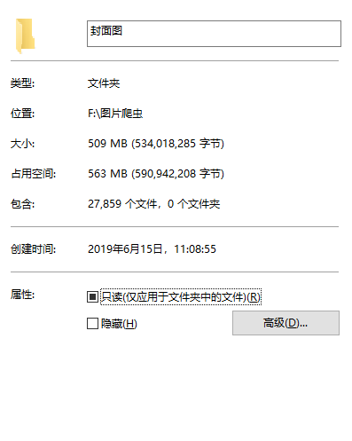
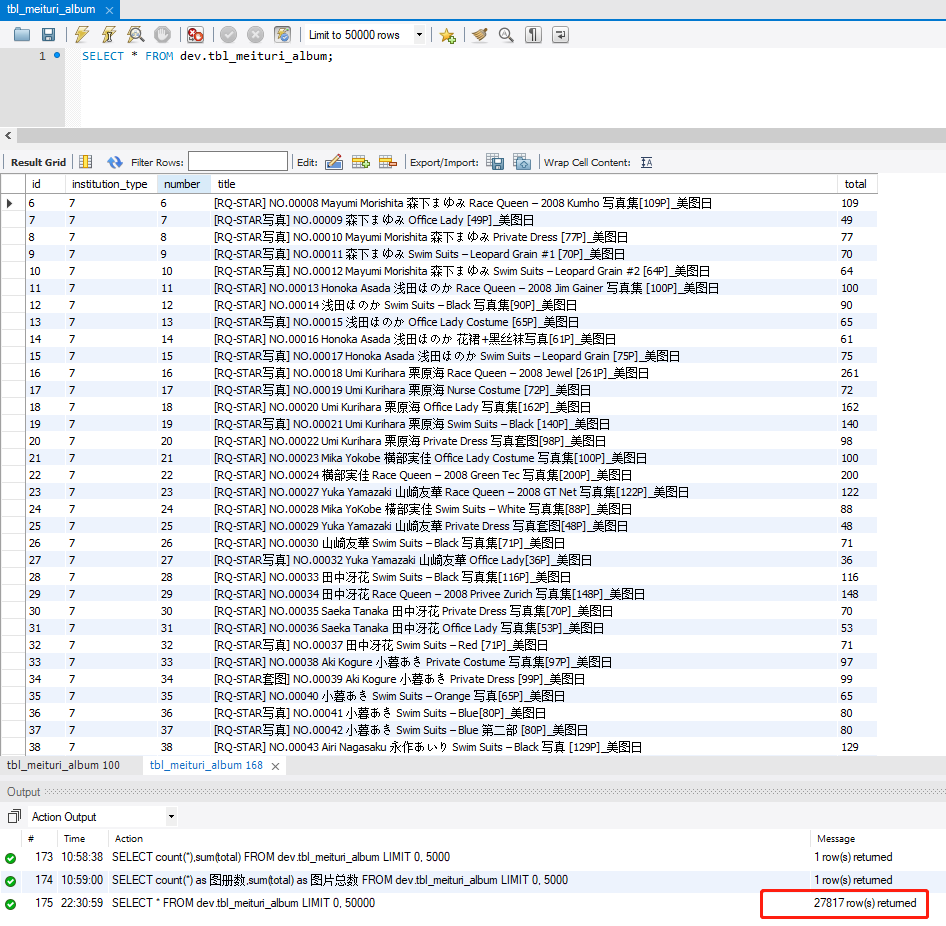
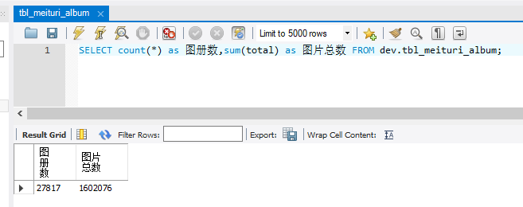
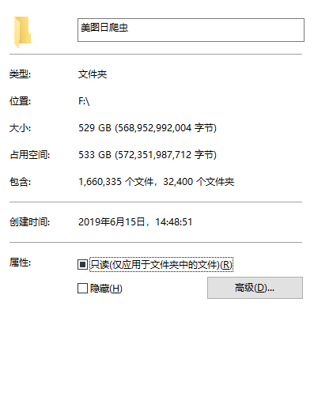
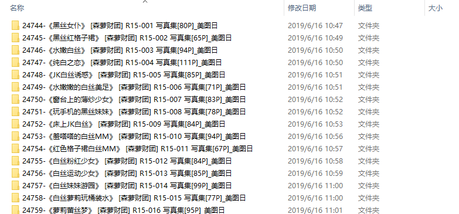

# Reptile4Meituri

美图日网站图片爬虫。嘿嘿嘿，你懂的！

`截止 2019-06-21，已累计爬取 88 个专业摄影机构，28420 个妹纸图册，1632118 张小姐姐的图片！！`

## 0 开始出发！

哼哼，先给目标网站来个简单的介绍：

> 美女写真机构 - 国内外各类美女写真机构厂商及写真集大全 -  美图日
>
> 网站入口：https://www.meituri.com/


## Step1 获取网站图册的具体数量
1.1 网站中随意选取一张图片进行，发现图片真实路径为 `https://ii.hywly.com/a/1/` + `图册编号` + `/` + `图片编号` + `.jpg`

```
https://ii.hywly.com/a/1/27691/2.jpg
```

1.2 图册总数很多，不同分类下的图册可能重复，那么实际数量究竟有多少呢？由于图册编号是全局唯一的，因此可以通过请求一遍封面图来获取整个网站的图册数。

之所以选择封面图的另一个原因是因为封面图的分辨率为 `249 * 375`，相比于高清图（`1800 * 2700`），非常的小巧，高效！

```java
@PostMapping("/step1")
public String step1() {
    final String LOCAL_FOLDER = "F:/图片爬虫/封面图/";
    for (int i = 1; i <= 35000; i++) {
        String onlinePath = MEITURI_IMG_URL_PREFIX + i + "/0.jpg";
        String localPath = i + "-0.jpg";
        String filePath = LOCAL_FOLDER + localPath;
        DownloadUtil.downloadPicture(onlinePath, filePath);
    }
    return "success";
}
```
封面图数量：



可以看到，截止到 2019-06-15，图册总数为 `27859`！由于网站的图片不定期地进行更新迭代，因此随着时间的增长，图册的数量会进一步增加。

1.3 图册问题解决了后，下一个问题是各图册对应的图片数问题。我们以相册为模型构造实体类。

```java
@Entity
@Table(name = "tbl_meituri_album2")
public class AlbumDO {

    /**
     * ID 主键
     */
    @Id
    @GeneratedValue(strategy = GenerationType.IDENTITY)
    @Column(name = "id")
    private Long id;

    /**
     * 编号
     * eg.27691
     */
    @Column(name = "number")
    private Integer number;

    /**
     * 总数
     * eg.58（0~58）
     */
    @Column(name = "total")
    private Integer total;

    /**
     * 标题（文件夹名的一部分）
     * eg.杨晨晨sugar《蕾丝控福利》 [语画界XIAOYU] Vol.051 写真集
     */
    @Column(name = "title")
    private String title;

    /**
     * 所属机构
     *
     * @see InstitutionTypeEnum
     */
    @Column(name = "institution_type")
    private Integer institutionType;

    // Getter and Setter……
}
```

## Step2 获取有效的图册编号，对应的图片总数，对应的机构编号并持久化。

Step2: 获取真正能访问的图册，并使用（Jsoup）获取各相册的图片数量，持久化到数据库（MySQL）中。

Step1 中获得的 27859 个相册并不都能正常访问。且由于下载业务需要知道各相册的图片数量以便进行遍历访问（通过暴力请求需要处理异常，效率低下，且容易由于网络波动而导致循环断掉）。

```java
@PostMapping("/step2")
public String step2() {
    // 当前相册最小编号
    final int ALBUM_MIN = 27865;
    // 当前相册最大编号
    final int ALBUM_MAX = 28467;
    // 用于提取单个相册图片总数的正则
    final Pattern p = Pattern.compile("\\d+P");

    for (int i = ALBUM_MIN; i <= ALBUM_MAX; i++) {
        if (albumJpaDAO.findByNumberEquals(i) != null) {
            logger.warn("==>step2() i={} 记录已存在，不再重复记录", i);
            continue;
        }
        Document document;
        try {
            document = Jsoup.connect(MEITURI_URL_PREFIX + i).get();
        } catch (IOException e) {
            // 打印 ERROR 级别 log 以便人工介入确认不能访问的真正原因。
            logger.error("==>step2() i={} 需人工介入确认不能访问的真正原因", i);
            // 请求失败直接进入下个循环
            continue;
        }
        String title = document.title();
        Elements elements = document.getElementsByTag("p");
        String elementsStr = elements.text();

        // 分析获取单个相册的图片总数
        Matcher matcher = p.matcher(elementsStr);
        int total = 0;
        if (matcher.find()) {
            total = Integer.parseInt(matcher.group(0).replace("P", ""));
        }

        // 持久化到数据库，注意此处并没有根据 InstitutionTypeEnum 枚举进行 institutionType 的赋值，
        // 这一步将涉及数据清洗，较为繁琐，代码未给出
        AlbumDO albumDO = new AlbumDO();
        albumDO.setNumber(i);
        albumDO.setTotal(total);
        albumDO.setTitle(title);
        albumJpaDAO.save(albumDO);

        // 打印 log，可省略
        logger.info("==>step2() albumDO.getNumber={} albumDO.getTotal={} albumDO.getTitle={}", albumDO.getNumber(), albumDO.getTotal(), albumDO.getTitle());
    }

    return "success";
}
```

```
结果：{555, 2567, 2568, 2578, 2684, 4359, 4375, 4398, 5237, 5254,
5259, 7244, 7457, 7489, 8188, 8279, 8350, 8375, 12101, 12118,
12160, 12930, 13074, 14944, 15613, 16559, 16683, 17728, 19385, 21688,
22449, 22565, 23376, 23427, 23983, 24063, 24083, 24197, 24290, 27271,
27272, 27273}; 共 42 个相册不能正常访问。
```

不能正常访问的相册：


存在两个机构的相册：


MySQL 截图



SQL 数据清洗：

```sql
UPDATE `dev`.`tbl_meituri_album2` SET `institution_type` = '57' WHERE `title` like '%Beautyleg%';
UPDATE `dev`.`tbl_meituri_album2` SET `institution_type` = '49' WHERE `title` like '%丽柜%';
UPDATE `dev`.`tbl_meituri_album2` SET `institution_type` = '31' WHERE `title` like '%克拉女神%';
UPDATE `dev`.`tbl_meituri_album2` SET `institution_type` = '62' WHERE `title` like '%尤果圈爱尤物%';
UPDATE `dev`.`tbl_meituri_album2` SET `institution_type` = '12' WHERE `title` like '%异思趣向%';
UPDATE `dev`.`tbl_meituri_album2` SET `institution_type` = '18' WHERE `title` like '%LOVEPOP%';
UPDATE `dev`.`tbl_meituri_album2` SET `institution_type` = '17' WHERE `title` like '%Digi%';
UPDATE `dev`.`tbl_meituri_album2` SET `institution_type` = '35' WHERE `title` like '%Minisuka%';
UPDATE `dev`.`tbl_meituri_album2` SET `institution_type` = '85' WHERE `title` like '%语画界%';
UPDATE `dev`.`tbl_meituri_album2` SET `institution_type` = '23' WHERE `title` like '%花漾%';
UPDATE `dev`.`tbl_meituri_album2` SET `institution_type` = '78' WHERE `title` like '%台湾正妹%';
UPDATE `dev`.`tbl_meituri_album2` SET `institution_type` = '67' WHERE `title` like '%嗲囡囡%';
UPDATE `dev`.`tbl_meituri_album2` SET `institution_type` = '45' WHERE `title` like '%头条女神%';
UPDATE `dev`.`tbl_meituri_album2` SET `institution_type` = '58' WHERE `title` like '%尤蜜荟%';
UPDATE `dev`.`tbl_meituri_album2` SET `institution_type` = '59' WHERE `title` like '%秀人%';
UPDATE `dev`.`tbl_meituri_album2` SET `institution_type` = '87' WHERE `title` like '%萝莉COS%';
UPDATE `dev`.`tbl_meituri_album2` SET `institution_type` = '86' WHERE `title` like '%风之领域%';
UPDATE `dev`.`tbl_meituri_album2` SET `institution_type` = '72' WHERE `title` like '%魅妍社%';
UPDATE `dev`.`tbl_meituri_album2` SET `institution_type` = '80' WHERE `title` like '%Cosdoki%';
UPDATE `dev`.`tbl_meituri_album2` SET `institution_type` = '28' WHERE `title` like '%Sabra%';
UPDATE `dev`.`tbl_meituri_album2` SET `institution_type` = '33' WHERE `title` like '%WPB-net%';
UPDATE `dev`.`tbl_meituri_album2` SET `institution_type` = '70' WHERE `title` like '%模范学院%';
UPDATE `dev`.`tbl_meituri_album2` SET `institution_type` = '88' WHERE `title` like '%丝意%';
```

## Step3: 下载图片。
通过对应的 GET 请求参数下载对应的图册。达到手动调节线程数的效果。为了避免重复请求导致重复下载，该接口做了幂等处理。

```java
private void doBatchDownload(List<AlbumDO> albumDOList) {
    for (AlbumDO albumDO : albumDOList) {

        int total = albumDO.getTotal();
        int num = albumDO.getNumber();
        String title = albumDO.getTitle();
        String fileFolder = InstitutionTypeEnum.getEnumBySeq(albumDO.getInstitutionType()).getDesc();

        String localFolder = MEITURI_LOCAL_PREFIX + fileFolder + "/" + num + "-" + title;
        // 若文件夹路径不存在，则新建
        File file = new File(localFolder);
        if (!file.exists()) {
            if (!file.mkdirs()) {
                logger.error("==>number={} title={} 创建文件路径失败", num, title);
            }
        }

        for (int i = 0; i <= total; i++) {
            String onlinePath = MEITURI_IMG_URL_PREFIX + num + "/" + i + ".jpg";
            String localPath = localFolder + "/" + i + ".jpg";

            // 幂等，若当前文件未下载，则进行下载
            File file2 = new File(localPath);
            if (!file2.exists()) {
                DownloadUtil.downloadPicture(onlinePath, localPath);
            }
        }
    }
}
```

MySQL 统计：



Step2 统计得出能正常访问的相册共 27817 个，图片总数为 1602076 张。

## Step4 成果展示





